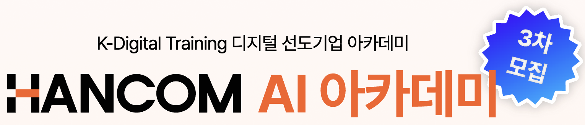

# Github-Pages

# Edu-Hancom-AI-Academy

**수신**: 신인철 강사님  
**발신**: 주식회사 스팩스페이스

## 1. 강의 개요

| 구분 | 내용 |
| :--- | :--- |
| **강의 주제** | 풀스택 강의 및 실습, 프로젝트 진행 |
| **강의 내용** | • HTML&CSS, JS&TS, React JS, 데이터베이스, 노드JS, 클라우드 서비스 • Python, FastAPI, 머신러닝/딥러닝, 딥러닝 활용(영상/자연어) • AI 서비스 개발 프로젝트 : 팀 단위 프로젝트 수행 및 결과 발표 |
| **강의 목표** | 풀스택 및 AI 개발자를 향해 전문성 기르기 및 취업 |
| **강의 대상** | 만 19세~34세 이하 (미취업 청년 25명 내외) |
| **교육생 분석** | 휴학생 및 취업 준비생 (성비 및 비전공생 혼합) |
| **강의 일정** | **2025.12.29(월) ~ 2026.06.29(월)** (총 120일, 공휴일 제외) |
| **강의 시간** | 월-금 09:00 ~ 18:00 (8H) (점심시간 12:00~13:00 / 50분 수업, 10분 휴식) |
| **강의 장소** | 서울 강서구 마곡중앙로 59-5, 마곡595빌딩 4층 (마곡역 6번출구) |
| **시설 지원** | 빔 프로젝터, 노트북, 무선 마이크, 2-3인 책상 배치 |

## 2. 강의 일정

| | |
| - | - |
| **강의 일정** | **2025.12.29(월) ~ 2026.06.29(월)** (총 120일, 공휴일 제외)
<!--
## 2. 강사료 및 요청사항

### 💰 강사료
* **금액**: 1교시(50분) 기준 6만원 × 960시간 = **57,600,000원 (세전)**
* **지급**: 월말 지급 예정

### ✅ 요청 사항
1.  **강의자료**: 강의 시작 일주일 전 제출 (혹은 교재로 수업 가능)
2.  **서류**: 강사 이력서, NCS 확인강사(코드: 200107 정보기술개발) 등록 및 보수교육 이수증

### 📢 기타 사항
* 상황에 따라 일정 및 제반사항의 변동이 발생할 수 있습니다.
* 진행된 강의는 홍보용(사진 및 영상)으로 제작될 수 있습니다. (지적재산권 침해 없는 범위, 3~5분 이내)
-->
<!--
## 3. 상세 커리큘럼 (총 960시간)

| 구분 | 교과목명 | 세부 학습 내용 | 시간 |
| :--- | :--- | :--- | :---: |
| **정규교과** | **프로그래밍 기초** | • HTML/CSS: 기본 문법, 태그 요소, 스타일시트 & 속성 • 페이지 레이아웃, HTML/CSS 연동 | 44 |
| | **JS / TS** | • 변수, 제어문, 반복문, 함수, 개발자 도구(디버깅) • 객체 및 구조분해 할당, JS를 TS로 업그레이드 | 56 |
| | **리액트JS** | • JSX, Rendering Elements, 가상 DOM • Components, Props, State, LifeCycle, Hooks • 상태 호이스팅, 이벤트 핸들러, Lists, Keys | 80 |
| | **리액트 모바일** | • 리액트 네이티브 기초, 컴포넌트, 레이아웃, 스타일링 • React Navigation, Redux, Context API • iOS/Android 앱 배포 | 80 |
| | **데이터베이스** | • MongoDB 라이브러리 설치, 테이블, Query, Sequelize • CRUD 구현, 로그인 구현을 위한 테이블 설계 | 34 |
| | **노드JS** | • 노드JS 기초, 파일/폴더 관리, 동기/비동기/콜백 • 패키지 매니저, Express 웹서버 구현 | 60 |
| | **클라우드 서비스** | • Linux CLI, 네트워크 설정 및 VPC • AWS 기본 사용법(EC2), 버킷/객체 관리, RDS | 16 |
| | **파이썬** | • 변수, 제어문, 반복문, 함수, 자료구조(List, Dict 등) • OOP, 정규표현식, 웹크롤링, DB, 파일입출력 | 37 |
| | **데이터 분석** | • 파이썬 중급(컴프리헨션, 람다) • Numpy(선형대수), Matplotlib(시각화), Pandas(분석) | 60 |
| | **FastAPI** | • FastAPI 서버, 인증, 암호 해싱, JSON 웹 토큰 • RESTful API, Response type | 60 |
| | **ML / DL 기초** | • 스케일링 및 전처리, 회귀 모델(로지스틱/소프트맥스) • 멀티레이어 모델 구축 | 60 |
| | **DL 활용(영상)** | • CNN 기초, VGG/GoogleNet/ResNet 분석 • 사전학습 모델 적용, YOLO 디텍션 모델 구축 | 40 |
| | **DL 활용(자연어)** | • RNN 기초, seq2seq, Attention, Transformer 구축 • 사전학습 모델 적용, OWPML 필터 한글 QA 서비스 | 40 |
| **기타** | **취업 특강** | • 입사지원서 및 자기소개서 작성법 | 3 |
| **프로젝트** | **파이널 프로젝트** | • **AI 코딩 어시스턴트 개발 (VSCode Extension)** | 290 |
| **합계** | | | **960** |

---

### 📞 담당자
* **이름**: 정한솔
* **연락처**: 010-6632-3919
* **이메일**: jini@sfacspace.com
-->